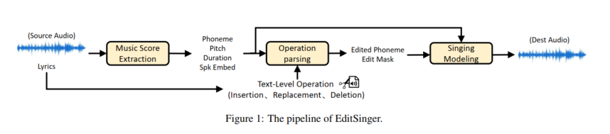
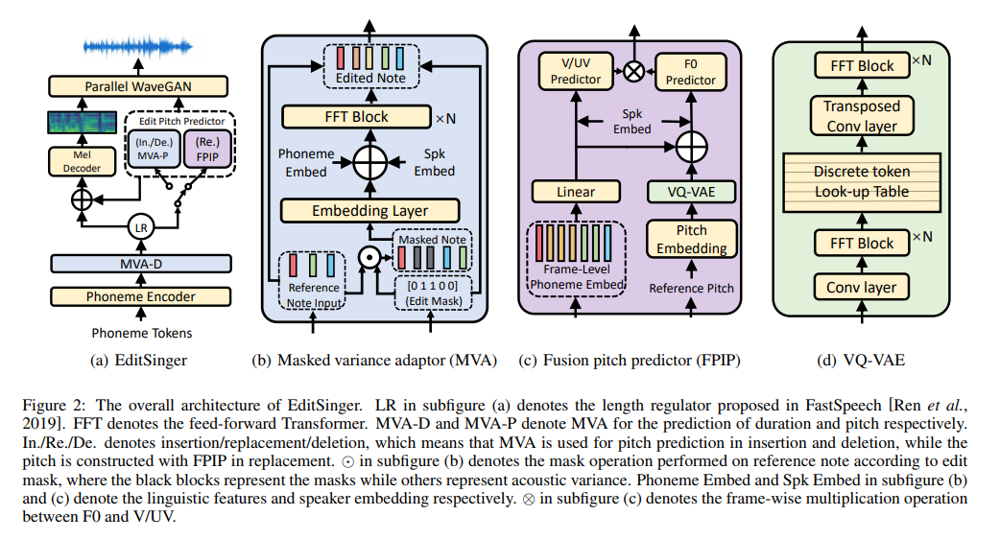

# 
EditSinger: Zero-Shot Text-Based Singing Voice Editing System with Diverse Prosody Modeling

## Abstract

Zero-shot text-based singing voice editing enables users to edit the singing content by just performing text operations on the lyrics, while  without any additional data from the target singer. However, due to the different demands, challenges occur when applying existing speech editing methods to singing voice editing task, mainly including the lack of systematic consideration concerning prosody in insertion and deletion, as well as the trade-off between the naturalness of pronunciation and the preservation of prosody in replacement. In this paper we propose EditSinger, which is a novel singing voice editing model with specially designed diverse prosody modules to overcome the challenges above. Specifically, 1) a general masked variance adaptor is introduced for the comprehensive prosody modeling of the inserted lyrics and the transition of deletion boundary; and 2) we further design a fusion pitch predictor for replacement. By disentangling the reference pitch and fusing the predicted pronunciation, the edited pitch can be reconstructed, which could ensure a natural pronunciation while preserving the prosody of the original audio. In addition, to the best of our knowledge, it is the first zero-shot text-based singing voice editing system. Our experiments conducted on the OpenSinger prove that EditSinger can synthesize high-quality edited singing voices with natural prosody according to the corresponding operations.

**The first two sections (Audio Samples & Method Analyses) are some samples of experiments in the paper.**  
**The third section (More Samples) provides more samples of different aspects (e.g., comparisons of different editing positions).**
## 1 Audio Samples
*Note: GT denotes the original audio(the input audio to be edited)*

#### Exp. 1:

original lyrics: 朋友爱得那么苦痛 (<BOS> p eng | y ou # ai | d e # n a | m e # k u | t ong <EOS>)  
insertion: 朋友如果爱的那么苦痛 (<BOS> p eng | y ou # r u | g uo # ai # d e # n a | m e # k u | t ong <EOS>)  
replacement: 朋友爱的那么认真(<strike>苦痛</strike>) (<BOS> p eng | y ou # ai # d e # n a | m e # r en | zh en <EOS>)  
deletion: 朋友爱的(<strike>那么</strike>)苦痛 (<BOS> p eng | y ou # ai # d e # k u | t ong <EOS>)  

    <table style='width: 100%;'>
        <thead>
        <tr>
            <th>GT</th>
            <th>GT(Mel+PWG)</th>
            <th>EditSinger(insertion)</th>
            <th>EditSinger(replacement)</th>
            <th>EditSinger(deletion)</th>
        </tr>
        </thead>
        <tbody>
        <tr>
            <td><audio style="width: 150px;" controls="" ><source src="resources/MOS1/GT/0000000001.mp3" type="audio/mp3"></audio></td>
            <td><audio style="width: 150px;" controls="" ><source src="resources/MOS1/GT(mel+pwg)/0000000001.wav" type="audio/wav"></audio></td>
            <td><audio style="width: 150px;" controls="" ><source src="resources/MOS1/editsinger(insertion)/0000000001.wav" type="audio/wav"></audio></td>
            <td><audio style="width: 150px;" controls="" ><source src="resources/MOS1/editsinger(replacement)/0000000001.wav" type="audio/wav"></audio></td>
            <td><audio style="width: 150px;" controls="" ><source src="resources/MOS1/editsinger(deletion)/0000000001.wav" type="audio/wav"></audio></td>
        </tr>
    </tbody>
    </table>

#### Exp. 2:
original lyrics: 爱可以不问对错 (<BOS> ai # k e | y i # b u | w en # d ui | c uo <EOS>)  
insertion: 爱怎么可以不问对错 (<BOS> ai # z en | m e # k e | y i # b u | w en # d ui | c uo <EOS>)  
replacement: 爱怎么(<strike>可以</strike>)不问对错 (<BOS> ai # z en | m e # b u | w en # d ui | c uo <EOS>)  
deletion: 爱(<strike>可以</strike>)不问对错 (<BOS> ai # b u | w en # d ui | c uo <EOS>)  

    <table style='width: 100%;'>
        <thead>
        <tr>
            <th>GT</th>
            <th>GT(Mel+PWG)</th>
            <th>EditSinger(insertion)</th>
            <th>EditSinger(replacement)</th>
            <th>EditSinger(deletion)</th>
        </tr>
        </thead>
        <tbody>
        <tr>
            <td><audio style="width: 150px;" controls="" ><source src="resources/MOS1/GT/0000000002.mp3" type="audio/mp3"></audio></td>
            <td><audio style="width: 150px;" controls="" ><source src="resources/MOS1/GT(mel+pwg)/0000000002.wav" type="audio/wav"></audio></td>
            <td><audio style="width: 150px;" controls="" ><source src="resources/MOS1/editsinger(insertion)/0000000002.wav" type="audio/wav"></audio></td>
            <td><audio style="width: 150px;" controls="" ><source src="resources/MOS1/editsinger(replacement)/0000000002.wav" type="audio/wav"></audio></td>
            <td><audio style="width: 150px;" controls="" ><source src="resources/MOS1/editsinger(deletion)/0000000002.wav" type="audio/wav"></audio></td>
        </tr>
    </tbody>
    </table>

#### Exp. 3:
original lyrics: 你何苦非为他等在雨中 (<BOS> n i # h e | k u # f ei | w ei # t a # d eng # z ai # y u # zh ong <EOS>)  
insertion: 你何苦非为他傻傻等在雨中 (<BOS> n i # h e | k u # f ei | w ei # t a # sh a | sh a # d eng # z ai # y u # zh ong <EOS>)  
replacement: 你何苦非为他伫立风(<strike>等在雨</strike>)中 (<BOS> n i # h e | k u # f ei | w ei # t a # zh u | l i # f eng | zh ong <EOS>)  
deletion: 你(<strike>何苦非</strike>)为他等在雨中 (<BOS> n i # w ei # t a # d eng # z ai # y u # zh ong <EOS>)  

    <table style='width: 100%;'>
        <thead>
        <tr>
            <th>GT</th>
            <th>GT(Mel+PWG)</th>
            <th>EditSinger(insertion)</th>
            <th>EditSinger(replacement)</th>
            <th>EditSinger(deletion)</th>
        </tr>
        </thead>
        <tbody>
        <tr>
            <td><audio style="width: 150px;" controls="" ><source src="resources/MOS1/GT/0000000003.mp3" type="audio/mp3"></audio></td>
            <td><audio style="width: 150px;" controls="" ><source src="resources/MOS1/GT(mel+pwg)/0000000003.wav" type="audio/wav"></audio></td>
            <td><audio style="width: 150px;" controls="" ><source src="resources/MOS1/editsinger(insertion)/0000000003.wav" type="audio/wav"></audio></td>
            <td><audio style="width: 150px;" controls="" ><source src="resources/MOS1/editsinger(replacement)/0000000003.wav" type="audio/wav"></audio></td>
            <td><audio style="width: 150px;" controls="" ><source src="resources/MOS1/editsinger(deletion)/0000000003.wav" type="audio/wav"></audio></td>
        </tr>
    </tbody>
    </table>

#### Exp. 4:
original lyrics: 几朵云在阴天忘了该往哪儿走 (<BOS> j i | d uo # y un # z ai # y in | t ian # w ang # l e # g ai # w ang # n a | r # z ou <EOS>)  
insertion: 几朵孤独的云在阴天忘了该往哪儿走 (<BOS> j i | d uo # g u | d u # d e # y un # z ai # y in | t ian # w ang # l e # g ai # w ang # n a | r # z ou <EOS>)  
replacement: 几片叶(<strike>朵云</strike>)在阴天忘了该往哪儿走 (<BOS> j i | p ian # y e | z ai # y in | t ian # w ang # l e # g ai # w ang # n a | r # z ou <EOS>)  
deletion: 几朵云(<strike>在阴天</strike>)忘了该往哪儿走 (<BOS> j i | d uo # y un | w ang # l e # g ai # w ang # n a | r # z ou <EOS>)  

    <table style='width: 100%;'>
        <thead>
        <tr>
            <th>GT</th>
            <th>GT(Mel+PWG)</th>
            <th>EditSinger(insertion)</th>
            <th>EditSinger(replacement)</th>
            <th>EditSinger(deletion)</th>
        </tr>
        </thead>
        <tbody>
        <tr>
            <td><audio style="width: 150px;" controls="" ><source src="resources/MOS1/GT/0000000011.mp3" type="audio/mp3"></audio></td>
            <td><audio style="width: 150px;" controls="" ><source src="resources/MOS1/GT(mel+pwg)/0000000011.wav" type="audio/wav"></audio></td>
            <td><audio style="width: 150px;" controls="" ><source src="resources/MOS1/editsinger(insertion)/0000000011.wav" type="audio/wav"></audio></td>
            <td><audio style="width: 150px;" controls="" ><source src="resources/MOS1/editsinger(replacement)/0000000011.wav" type="audio/wav"></audio></td>
            <td><audio style="width: 150px;" controls="" ><source src="resources/MOS1/editsinger(deletion)/0000000011.wav" type="audio/wav"></audio></td>
        </tr>
    </tbody>
    </table>

#### Exp. 5:
original lyrics: 被吹进了左耳 (<BOS> b ei # ch ui | j in # l e # z uo | er <EOS>)  
insertion: 被思念吹进了左耳 (<BOS> b ei # s i | n ian # ch ui | j in # l e # z uo | er <EOS>)  
replacement: 被传递到(<strike>吹进了</strike>)左耳 (<BOS> b ei # ch uan | d i # d ao # z uo | er <EOS>)  
deletion: 被吹进(<strike>了</strike>)左耳 (<BOS> b ei # ch ui | j in # z uo | er <EOS>)  

    <table style='width: 100%;'>
        <thead>
        <tr>
            <th>GT</th>
            <th>GT(Mel+PWG)</th>
            <th>EditSinger(insertion)</th>
            <th>EditSinger(replacement)</th>
            <th>EditSinger(deletion)</th>
        </tr>
        </thead>
        <tbody>
        <tr>
            <td><audio style="width: 150px;" controls="" ><source src="resources/MOS1/GT/0000000012.mp3" type="audio/mp3"></audio></td>
            <td><audio style="width: 150px;" controls="" ><source src="resources/MOS1/GT(mel+pwg)/0000000012.wav" type="audio/wav"></audio></td>
            <td><audio style="width: 150px;" controls="" ><source src="resources/MOS1/editsinger(insertion)/0000000012.wav" type="audio/wav"></audio></td>
            <td><audio style="width: 150px;" controls="" ><source src="resources/MOS1/editsinger(replacement)/0000000012.wav" type="audio/wav"></audio></td>
            <td><audio style="width: 150px;" controls="" ><source src="resources/MOS1/editsinger(deletion)/0000000012.wav" type="audio/wav"></audio></td>
        </tr>
    </tbody>
    </table>

#### Exp. 6:
original lyrics: 在昏暗中的我 (<BOS> z ai # h un | an # zh ong # d e # w o <EOS>)  
insertion: 在那时昏暗中的我 (<BOS> z ai # n a | sh i # h un | an # zh ong # d e # w o <EOS>)  
replacement: 在昏暗中与你(<strike>的我</strike>) (<BOS> z ai # h un | an # zh ong # y u # n i <EOS>)  
deletion: 在昏暗(<strike>中</strike>)的我 (<BOS> z ai # h un | an # d e # w o <EOS>)  

    <table style='width: 100%;'>
        <thead>
        <tr>
            <th>GT</th>
            <th>GT(Mel+PWG)</th>
            <th>EditSinger(insertion)</th>
            <th>EditSinger(replacement)</th>
            <th>EditSinger(deletion)</th>
        </tr>
        </thead>
        <tbody>
        <tr>
            <td><audio style="width: 150px;" controls="" ><source src="resources/MOS1/GT/0000000013.mp3" type="audio/mp3"></audio></td>
            <td><audio style="width: 150px;" controls="" ><source src="resources/MOS1/GT(mel+pwg)/0000000013.wav" type="audio/wav"></audio></td>
            <td><audio style="width: 150px;" controls="" ><source src="resources/MOS1/editsinger(insertion)/0000000013.wav" type="audio/wav"></audio></td>
            <td><audio style="width: 150px;" controls="" ><source src="resources/MOS1/editsinger(replacement)/0000000013.wav" type="audio/wav"></audio></td>
            <td><audio style="width: 150px;" controls="" ><source src="resources/MOS1/editsinger(deletion)/0000000013.wav" type="audio/wav"></audio></td>
        </tr>
    </tbody>
    </table>

## 2 Method Analyses
### 2.1 Insertion
#### Exp. 1:
original lyrics: 朋友爱得那么苦痛 (<BOS> p eng | y ou # ai | d e # n a | m e # k u | t ong <EOS>)  
insertion: 朋友如果爱的那么苦痛 (<BOS> p eng | y ou # r u | g uo # ai # d e # n a | m e # k u | t ong <EOS>)  

    <table style='width: 100%;'>
        <thead>
        <tr>
            <th>GT</th>
            <th>GT(Mel+PWG)</th>
            <th>EditSinger(insertion)</th>
            <th>w/o CVA</th>
            <th>w/o ML-GAN</th>
        </tr>
        </thead>
        <tbody>
        <tr>
            <td><audio style="width: 150px;" controls="" ><source src="resources/MOS1/GT/0000000001.mp3" type="audio/mp3"></audio></td>
            <td><audio style="width: 150px;" controls="" ><source src="resources/MOS1/GT(mel+pwg)/0000000001.wav" type="audio/wav"></audio></td>
            <td><audio style="width: 150px;" controls="" ><source src="resources/MOS1/editsinger(insertion)/0000000001.wav" type="audio/wav"></audio></td>
            <td><audio style="width: 150px;" controls="" ><source src="resources/CMOS/insertion/womva/0000000001.wav" type="audio/wav"></audio></td>
            <td><audio style="width: 150px;" controls="" ><source src="resources/CMOS/insertion/wogan/0000000001.wav" type="audio/wav"></audio></td>
        </tr>
            
    </tbody>
    </table>

#### Exp. 2:
original lyrics: 几朵云在阴天忘了该往哪儿走 (<BOS> j i | d uo # y un # z ai # y in | t ian # w ang # l e # g ai # w ang # n a | r # z ou <EOS>)  
insertion: 几朵孤独的云在阴天忘了该往哪儿走 (<BOS> j i | d uo # g u | d u # d e # y un # z ai # y in | t ian # w ang # l e # g ai # w ang # n a | r # z ou <EOS>)  

    <table style='width: 100%;'>
        <thead>
        <tr>
            <th>GT</th>
            <th>GT(Mel+PWG)</th>
            <th>EditSinger(insertion)</th>
            <th>w/o CVA</th>
            <th>w/o ML-GAN</th>
        </tr>
        </thead>
        <tbody>
        <tr>
            <td><audio style="width: 150px;" controls="" ><source src="resources/MOS1/GT/0000000011.mp3" type="audio/mp3"></audio></td>
            <td><audio style="width: 150px;" controls="" ><source src="resources/MOS1/GT(mel+pwg)/0000000011.wav" type="audio/wav"></audio></td>
            <td><audio style="width: 150px;" controls="" ><source src="resources/MOS1/editsinger(insertion)/0000000011.wav" type="audio/wav"></audio></td>
            <td><audio style="width: 150px;" controls="" ><source src="resources/CMOS/insertion/womva/0000000011.wav" type="audio/wav"></audio></td>
            <td><audio style="width: 150px;" controls="" ><source src="resources/CMOS/insertion/wogan/0000000011.wav" type="audio/wav"></audio></td>
        </tr>
            

    </tbody>
    </table>

### 2.2 Deletion

#### Exp. 1:
original lyrics: 你何苦非为他等在雨中 (<BOS> n i # h e | k u # f ei | w ei # t a # d eng # z ai # y u # zh ong <EOS>)  
deletion: 你(<strike>何苦非</strike>)为他等在雨中 (<BOS> n i # w ei # t a # d eng # z ai # y u # zh ong <EOS>>)  

    <table style='width: 100%;'>
        <thead>
        <tr>
            <th>GT</th>
            <th>GT(Mel+PWG)</th>
            <th>EditSinger(deletion)</th>
            <th>w/o CVA</th>
            <th>w/o ML-GAN</th>
        </tr>
        </thead>
        <tbody>
        <tr>
            <td><audio style="width: 150px;" controls="" ><source src="resources/MOS1/GT/0000000003.mp3" type="audio/mp3"></audio></td>
            <td><audio style="width: 150px;" controls="" ><source src="resources/MOS1/GT(mel+pwg)/0000000003.wav" type="audio/wav"></audio></td>
            <td><audio style="width: 150px;" controls="" ><source src="resources/MOS1/editsinger(deletion)/0000000003.wav" type="audio/wav"></audio></td>
            <td><audio style="width: 150px;" controls="" ><source src="resources/CMOS/deletion/womva/0000000003.wav" type="audio/wav"></audio></td>
            <td><audio style="width: 150px;" controls="" ><source src="resources/CMOS/deletion/wogan/0000000003.wav" type="audio/wav"></audio></td>
        </tr>
        

        
    </tbody>
    </table>

#### Exp. 2:
original lyrics: 几朵云在阴天忘了该往哪儿走 (<BOS> j i | d uo # y un # z ai # y in | t ian # w ang # l e # g ai # w ang # n a | r # z ou <EOS>)  
deletion: 几朵云(<strike>在阴天</strike>)忘了该往哪儿走 (<BOS> j i | d uo # y un | w ang # l e # g ai # w ang # n a | r # z ou <EOS>)  

    <table style='width: 100%;'>
        <thead>
        <tr>
            <th>GT</th>
            <th>GT(Mel+PWG)</th>
            <th>EditSinger(deletion)</th>
            <th>w/o CVA</th>
            <th>w/o ML-GAN</th>
        </tr>
        </thead>
        <tbody>
        <tr>
            <td><audio style="width: 150px;" controls="" ><source src="resources/MOS1/GT/0000000011.mp3" type="audio/mp3"></audio></td>
            <td><audio style="width: 150px;" controls="" ><source src="resources/MOS1/GT(mel+pwg)/0000000011.wav" type="audio/wav"></audio></td>
            <td><audio style="width: 150px;" controls="" ><source src="resources/MOS1/editsinger(deletion)/0000000011.wav" type="audio/wav"></audio></td>
            <td><audio style="width: 150px;" controls="" ><source src="resources/CMOS/deletion/womva/0000000011.wav" type="audio/wav"></audio></td>
            <td><audio style="width: 150px;" controls="" ><source src="resources/CMOS/deletion/wogan/0000000011.wav" type="audio/wav"></audio></td>
        </tr>
            
            
    </tbody>
    </table>

### 2.3 Replacement (Dang Test)
*Note: In this part, it can fully demonstrate the superior performance of Editsinger(replacement), and it even supports the replacement of entire sentences, which is not available in previous work. "Dang" here can be understood as any character. We have tested many other characters and done experiments including part and whole sentence replacement experiments, which are also very effective. Directly migrating the original prosody (Direct) to the new word without considering the attributes of the word will lead to a decrease in the sense of hearing, and ignoring the prosody of the corresponding position (w/o FPIP) will lead to a decrease in the similarity with the original song.*
#### Exp. 1:
original lyrics: 想挡挡你心口里的风 (<BOS> x iang # d ang # d ang # n i # x in # k ou | l i # d e # f eng <EOS>)  
replacement: 当当当当当当当当当 (<BOS> d ang | d ang # d ang | d ang # d ang | d ang # d ang | d ang # d ang <EOS>)  

    <table style='width: 100%;'>
        <thead>
        <tr>
            <th>GT</th>
            <th>GT(Mel+PWG)</th>
            <th>EditSinger(replacement)</th>
            <th>Direct</th>
            <th>w/o FPIP</th>
            <th>w/o VQVAE</th>
            <th>w/o ML-GAN</th>
        </tr>
        </thead>
        <tbody>
        <tr>
            <td><audio style="width: 150px;" controls="" ><source src="resources/MOS1/GT/0000000004.mp3" type="audio/mp3"></audio></td>
            <td><audio style="width: 150px;" controls="" ><source src="resources/MOS1/GT(mel+pwg)/0000000004.wav" type="audio/wav"></audio></td>
            <td><audio style="width: 150px;" controls="" ><source src="resources/MOS2/editsinger(replacement)/0000000004.wav" type="audio/wav"></audio></td>
            <td><audio style="width: 150px;" controls="" ><source src="resources/MOS2/direct/0000000004.wav" type="audio/wav"></audio></td>
            <td><audio style="width: 150px;" controls="" ><source src="resources/MOS2/context-aware/0000000004.wav" type="audio/wav"></audio></td>
            <td><audio style="width: 150px;" controls="" ><source src="resources/MOS2/wovqvae/0000000004.wav" type="audio/wav"></audio></td>
            <td><audio style="width: 150px;" controls="" ><source src="resources/MOS2/wogan/0000000004.wav" type="audio/wav"></audio></td>
        </tr>

    </tbody>
    </table>

#### Exp. 2:
original lyrics: 听阴天说什么 (<BOS> t ing # y in | t ian # sh uo # sh en | m e <EOS>)  
replacement: 当当当当当当 (<BOS> d ang | d ang # d ang | d ang # d ang | d ang <EOS>)  

    <table style='width: 100%;'>
        <thead>
        <tr>
            <th>GT</th>
            <th>GT(Mel+PWG)</th>
            <th>EditSinger(replacement)</th>
            <th>Direct</th>
            <th>w/o FPIP</th>
            <th>w/o VQVAE</th>
            <th>w/o ML-GAN</th>
        </tr>
        </thead>
        <tbody>
        <tr>
            <td><audio style="width: 150px;" controls="" ><source src="resources/MOS1/GT/0000000020.mp3" type="audio/mp3"></audio></td>
            <td><audio style="width: 150px;" controls="" ><source src="resources/MOS1/GT(mel+pwg)/0000000020.wav" type="audio/wav"></audio></td>
            <td><audio style="width: 150px;" controls="" ><source src="resources/MOS2/editsinger(replacement)/0000000020.wav" type="audio/wav"></audio></td>
            <td><audio style="width: 150px;" controls="" ><source src="resources/MOS2/direct/0000000020.wav" type="audio/wav"></audio></td>
            <td><audio style="width: 150px;" controls="" ><source src="resources/MOS2/context-aware/0000000020.wav" type="audio/wav"></audio></td>
            <td><audio style="width: 150px;" controls="" ><source src="resources/MOS2/wovqvae/0000000020.wav" type="audio/wav"></audio></td>
            <td><audio style="width: 150px;" controls="" ><source src="resources/MOS2/wogan/0000000020.wav" type="audio/wav"></audio></td>
        </tr>
    
        
    </tbody>
    </table>

## 3 More Samples
### Editing at Different Positions
original lyrics: 朋友爱得那么苦痛 (<BOS> p eng | y ou # ai | d e # n a | m e # k u | t ong <EOS>)  

    <table style='width: 100%;'>
        <thead>
        <tr>
            <th>Type</th>
            <th>GT</th>
            <th>Begining</th>
            <th>Middle</th>
            <th>End</th>
        </tr>
        </thead>
        <tbody>

        <tr>
	  <td>insertion</td>
            <td><audio style="width: 150px;" controls="" ><source src="resources/MOS1/GT(mel+pwg)/0000000001.wav" type="audio/wav"></audio></td>
            <td><audio style="width: 150px;" controls="" ><source src="resources/more/insertion/0000000001_1.wav" type="audio/wav"></audio></td>
            <td><audio style="width: 150px;" controls="" ><source src="resources/more/insertion/0000000001_2.wav" type="audio/wav"></audio></td>
  	  <td><audio style="width: 150px;" controls="" ><source src="resources/more/insertion/0000000001_3.wav" type="audio/wav"></audio></td>
        </tr>    

        <tr>
	  <td></td>
            <td></td>
            <td>如果朋友爱的那么苦痛</td>
            <td>朋友如果爱的那么苦痛</td>
	  <td>朋友爱的那么苦痛如果</td>
        </tr>  

        <tr>
	  <td>deletion</td>
            <td></td>
            <td><audio style="width: 150px;" controls="" ><source src="resources/more/deletion/0000000001_1.wav" type="audio/wav"></audio></td>
            <td><audio style="width: 150px;" controls="" ><source src="resources/more/deletion/0000000001_2.wav" type="audio/wav"></audio></td>
  	  <td><audio style="width: 150px;" controls="" ><source src="resources/more/deletion/0000000001_3.wav" type="audio/wav"></audio></td>
        </tr>    
       

        <tr>
	  <td></td>
            <td></td>
            <td>(<strike>朋友</strike>)爱的那么苦痛</td>
 	  <td>朋友爱的(<strike>那么</strike>)苦痛</td>
	  <td>朋友爱的那么苦(<strike>痛</strike>)</td>
        </tr>    

	<tr>
	  <td>replacement</td>
            <td></td>
            <td><audio style="width: 150px;" controls="" ><source src="resources/more/replacement/0000000001_1.wav" type="audio/wav"></audio></td>
            <td><audio style="width: 150px;" controls="" ><source src="resources/more/replacement/0000000001_2.wav" type="audio/wav"></audio></td>
  	  <td><audio style="width: 150px;" controls="" ><source src="resources/more/replacement/0000000001_3.wav" type="audio/wav"></audio></td>
        </tr>    

	<tr>
	  <td></td>
            <td></td>
            <td>认真(<strike>朋友</strike>)爱的那么苦痛</td>
            <td>朋友爱的认真(<strike>那么</strike>)苦痛</td>
	  <td>朋友爱的那么认真(<strike>苦痛</strike>)</td>
        </tr>    

    </tbody>
    </table>

